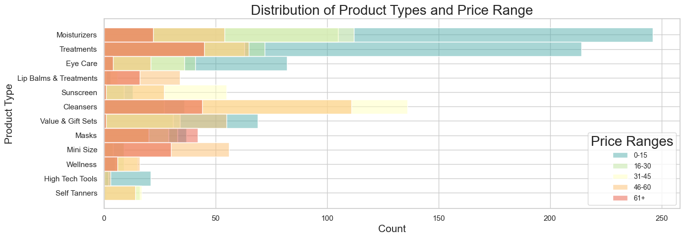
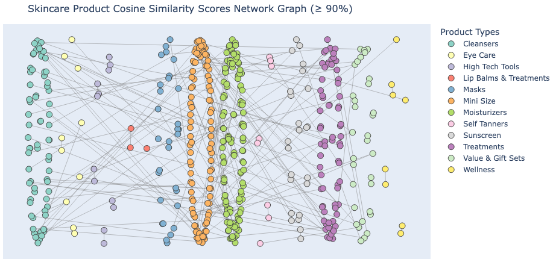
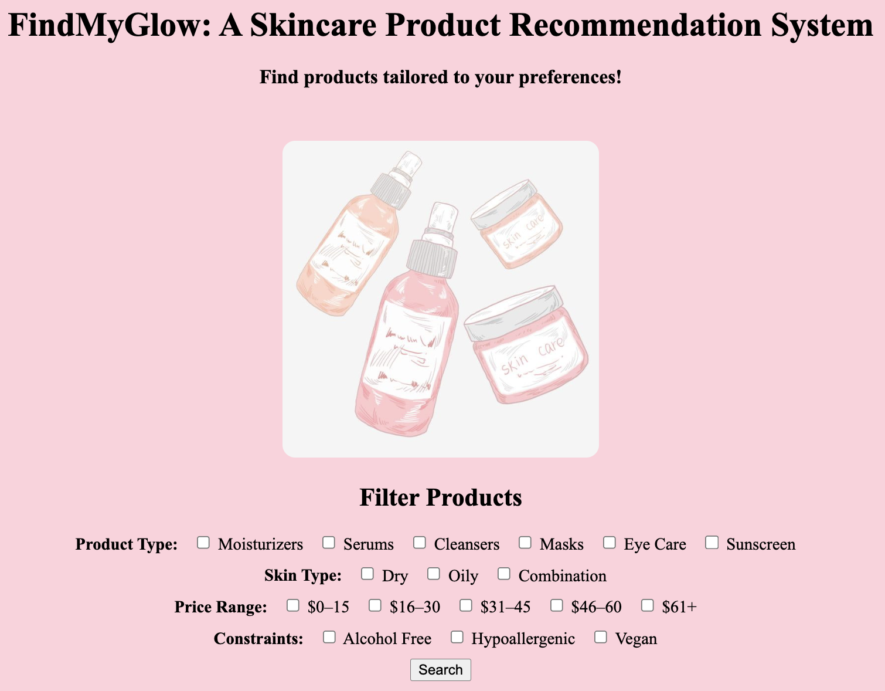
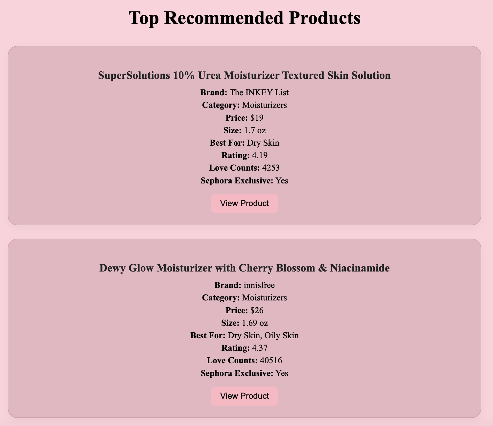
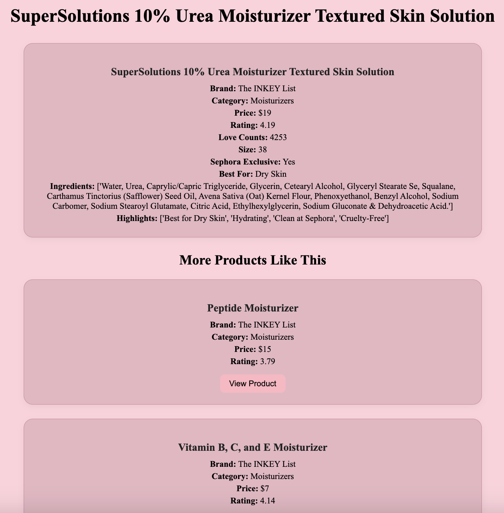
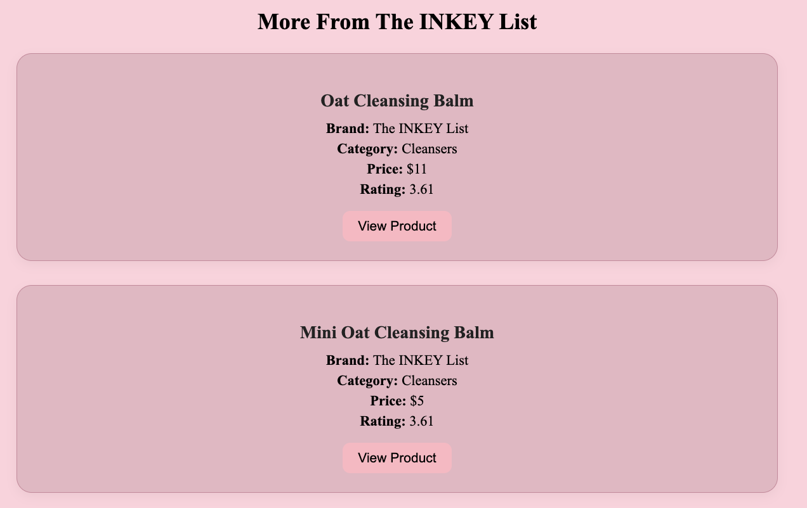

# FindMyGlow - Skincare Product Recommender System
- April 29th 2024
- DSC 4900 - Data Science Project/Portfolio
- Belmont University
- Author: Numa Rahman

# Table of Contents
---
  * Introduction
  * Gathering and Cleaning Data
    * Dataset Description
    * Data Cleaning
  * Database Creation
  * Building out the Recommender System
      * Feature Engineering and Natural Language Processing
      * Cosine Similarity
      * Filtering Mechanism
  * Website Creation Using Flask
  * Navigating Through the Website
  * Overview of Advanced Topics
  * Conclusion

## Introduction

The skincare industry can be overwhelming with so many products available on the market, so I wanted to build something that helps people cut through the noise. There are thousands of products out there all claiming different benefits, but it’s not always easy to know what’s actually right for your skin. Factors like skin type, sensitivity, ingredient preferences, and price range play a role in what works best for each person. My goal was to create a tool that helps users discover products based on their needs, using features that truly matter. 

## Gathering and Cleaning Data

### Gathering Data
I found this data from a publicly available dataset on Kaggle containing over 2,000 skincare products from Sephora. This is the link to the dataset: https://www.kaggle.com/datasets/nadyinky/sephora-products-and-skincare-reviews

<b>Key Variable:</b>
  * <b> product_name:</b> Name of product
  * <b> brand_name:</b>  Name of brand
  * <b> product_category:</b> Kind of skincare product (e.g., moisturizer, cleanser, treatments, etc)
  * <b> price:</b> Price of product
  * <b> ingredients:</b> String of ingredients in product
  * <b> highlights:</b> What makes the product unique. Includes tags like "alcohol free", "cruelty free", "paraben free", "Hypoallergenic", etc.
  * <b> for_dry_skin:</b> Dummy variable for classifying if the product is good for dry skin
  * <b> for_oily_skin:</b> Dummy variable for classifying if the product is good for oily skin
  * <b> for_combination_skin:</b> Dummy variable for classifying if the product is good for combination skin
  * <b> rating:</b> Average rating of a product
  * <b> love_counts:</b> Number of people who loved the product
  * <b> sephora_exclusive:</b> Products only sold at Sephora

This histogram shows that moisturizers and treatments are the most common product types, with the widest price spread, indicating a high variety in both budget and premium offerings. The color coding reveals how different price tiers are represented within each product type, helping highlight which categories tend to skew affordable versus luxury.

### Data Cleaning

This dataset contained sephora products and its reviews, so I filtered the dataset to only include skincare products. Each product included attributes like name, brand, category, price, size, ingredients, highlights, Sephora exclusivity, and loves count.

<b>Cleaning Steps:</b>
  * Removed products with key missing details such as ingredients
    * I viewed ingredients as the most important feature to use for recommending. 
  * Filled missing values with appropriate values
    * For example, if highlights was null, I inputed "No highlights"
  * Standardized text (lowercased all ingredients, highlights, and brand names)
  * Parsed "highlights" into binary columns for dry, oily, combination
  * Converted features into appropriate data types for machine learning
  * Added a "price_range" to separate the products based on affordability

## Database Creation

To efficiently send data to the web app, I stored product information into an SQLite database. I did this by install the SQLite package through VSCode and inputed my dataframe into a database.

## Building out the Recommender System 👨‍💻

After integrating the data into a database, I was able to start buidling out the recommender system.

### Feature Engineering and Natural Language Processing (TF-IDF)

Term frequency-inverse document frequency (TF-IDF) in a natural language processing technique that converts a piece of text into a numerical vector to highlight which words are most important in a piece of text while downplaying common ones. Since the "ingredients" and "highlights" fields were in free-text form, I needed a way to extract meaningful numerical features from them. TF-IDF allowed me to assign higher weights to distinctive terms like "hyaluronic acid" or "salicylic acid," rather than common words like "water." Without it, the model wouldn't understand which ingredients make products unique.

Step-by-Step Process:
 * Preprocessed text by lowercasing, removing punctuation, and removing common stop words such as "and" or "with"
 * Used TfidfVectorizer from Scikit-learn to numerically represent the text in the ingredients and highlights fields. This allowed me to quantify how important a term is to a product relative to the rest by helping the model understand semantic meaning behind the text.
 * Combined TF-IDF matrices of "ingredients" and "highlights" to create a full product representation

This process can be seen in recommender.ipynb

### Cosine Similarity

Once I had the TF-IDF matrix, I computed the cosine similarity between all products. Cosine similarity measures how similar two products are by calculating the angles between their vectors. Scores close to 1 mean they are very similar, and scores closer to 0 means they are very different. In the context of this project, each product's ingredients and highlights were vectorized by using TF-IDF. Then, I used cosine similarity quantified how closely two products align in terms of those vectors. 

I decided to use cosine similarity it allowed me to ignore the absolute number of ingredients and focus purely on how similar the content was. For example, two products might have different lengths of ingredient lists, but if they both emphasize "hyaluronic acid" and "glycerin," cosine similarity would recognize them as similar. By using both TF-IDF and cosine similarity, the model understand what makes a product unique and to find and rank other products that are the most similar based on content.

Step-by-Step Process:
 * After constructing the combined TF-IDF matrix, I calculated the pairwise cosine similarity matrix
 * Each row of the matrix represents a product, and each column shows how similar it is to other products
 * For each product, I extracted the top 5 most similar products and stored them in a dictionary for quick lookup when users view a product

After computing the cosine similarity scores for each product, I created a network graph to visualize how skincare products relate to one another using cosine similarity scores. Each node represents a product, and each line represents a similarity score of 90% or higher between two products, based on shared product details. This graph revealed strong clusters within product categories and showed how interconnected the categories are. 

## Website Creation using Flask

I built a Flask web application to allow users to interact with the recommender system in a user-friendly manner.

Files and Their Functions:
 * <b>app.py:</b>
   * Main Flask application file
   * It handles the route, connects to database, displays filters, processes filters, and retrieved filtered products
   * Uses cosine similarity to rank results to users based on their desired filters. This allows the recommendations to be sorted by relevance rather than exact match
   * Uses cosine similarity on product page to show the top 5 most similar products and other products from the same brand
 
 * <b>index.html:</b>
   * Homepage template
   * Contains where users select filters: product type, skin type, budget, brand, and product constraints
   * Submits filters to the /results route
  
 * <b>results.html</b>
   * Results page template
   * Displays a list of products that match user-selected filters
   * Each product links to its own detail page
 
 * <b>product.html</b>
   * Product detail page template
   * Displays detailed product information (name, brand, price, ingredients, highlights, loves count)
   * Shows recommended similar products (cosine similarity) and products from the same brand
  
 * <b>style.css:</b>
   * Styles homepage, results page, and product pages
   * Includes styling for dropdown menus, product cards, navigation buttons, and page layout
  

## Navigating Through Website

Users begin on the homepage, seen below, by selecting filters. These filters are processed in the backend using strict matching for category and price, and flexible filtering for skin types and constraints. 

### Homepage

After submitting, the website displays a list of recommended products, seen below, that match the filters, automatically sorted by relevance. 

### Results Page

Clicking on a product leads to a detailed page showing full product information, along with two sections: “More Products Like This”, shown in Figure 5, which uses cosine similarity scores to show the top 5 most similar products, and “More From This Brand”, which lists more products by the same brand. These sections help users discover alternatives and explore related options easily.

### Product Detail Page and "More Like This"

### "More from This Brand"

## Advanced Topics

<b>Feature Engineering (0.5 points)</b> - Applied one-hot encoding to skin type flags and filtered price ranges to better support simpler filtering in the webiste

<b>Database Creation (1 point)</b> - I designed and implemented a SQLite database to store the skincare product dataset for easy web app integration

<b>Website Using Flask (1 point)</b> - I built a full web application using Flask to create an interactive user experience

<b>Cosine Similarity (1 point)</b> - I used cosine similarity to compute how similar products are to one another.

<b>Natural Language Processing (2 points)</b> - I applied TF-IDF vectorization to ingredient and highlight fields to transform unstructured text into meaningful numerical features for measuring similarity between products.

## Conclusion

Overall, Find My Glow is a content-based skincare recommender that offers real value to users looking for new skincare options, especially those unsure where to start. It gives people a smarter, more personalized way to shop by making skincare more accessible, personalized, and informed. 

